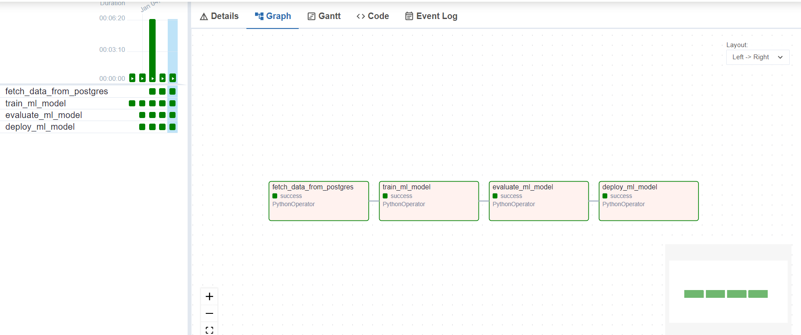

Here's the properly organized Markdown format for your script:

```md
# How to Use the Script

## 1. Save the Script
Save the script as `start_airflow_mysql.sh` in the directory where your `docker-compose.yml` file is located.

## 2. Make the Script Executable
Open your terminal, navigate to the directory where the script is saved, and run the following command:

```bash
chmod +x start_airflow_mysql.sh
```

## 3. Run the Script
Execute the script to manage the services:

```bash
./start_airflow_mysql.sh
```

This will display a menu with options to:
- Start the services (MySQL + Airflow)
- Stop the services
- View logs from both containers
- Restart the services
- Check the status of the services

---

# What the Script Does

- **Start Services**: Runs `docker-compose up -d` to start both MySQL and Airflow containers in detached mode.
- **Stop Services**: Runs `docker-compose down` to stop and remove the containers.
- **View Logs**: Displays live logs from the services using `docker-compose logs -f`.
- **Restart Services**: Stops and restarts both services.
- **Check Status**: Shows the current status of the containers using `docker-compose ps`.

---

## Architecture


#### Sample Dag - Local Testing 

